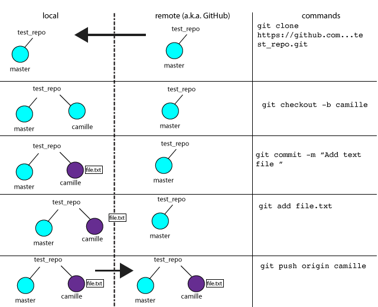

# Git Workflow Examples
(more to come)

Here's a small git refresher for now:

## End of day PRs
- `git status`
- `git add FILENAME` add any changed files
- `git commit -m "my descriptive commit message"`
- `git push origin pair-camillevilla,bobross`
- Go to the GitHub repo for the exercise (e.g. sf-fiddlercrabs-2017/regex-drill)
- Click on the `Pull requests` tab

- Click on the green "New pull request" button
- Set the two branch for comparison. The base should be `master` and the compare branch should be your pair branch (e.g. `pair-camillevilla,bobross`)

- Add comments, tag your advisor for a code review, etc.
- Click the green "Create pull request" button

