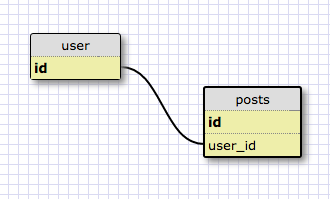
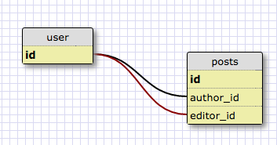
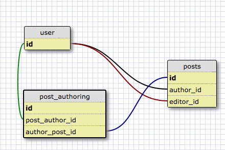

# Schema Examples for [Odin Project: Active Record Associations](http://www.theodinproject.com/courses/ruby-on-rails/lessons/active-record-associations)

I ❤️ the Odin Project's article on advanced associations. A couple of students told me it was difficult to read through dense descriptions of AR associations without a schema. The examples below are meant to accompany the first part of ["Active Record Associations"](http://www.theodinproject.com/courses/ruby-on-rails/lessons/active-record-associations). 

## Foreign Keys and Class Names
We'll start a one-to-many relationship. A post has one user, a user has many posts.

Now we add in some additional information. A post has both an author and an editor. Post now points to two different user_ids, so we'll need to use `:class_name` to rename them.

## Source

In the next example, we change our schema to create a many-to-many relationship between users and posts. A post can have many authors; an author can create many posts.

