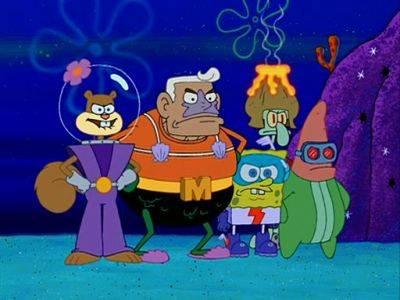
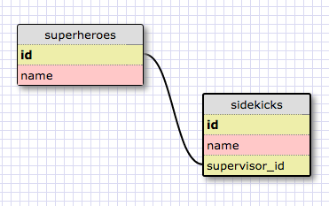
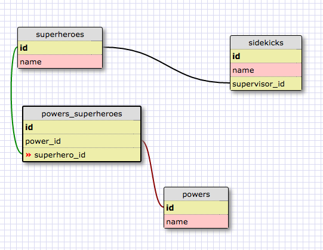
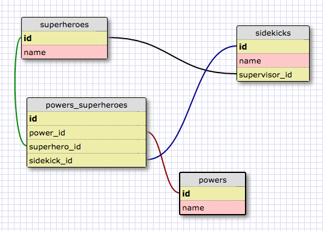
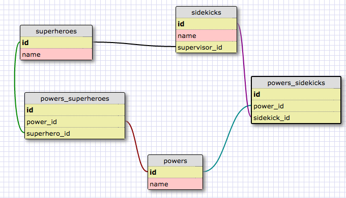
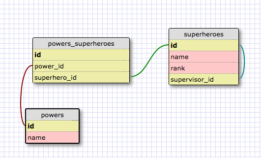

# Schema Design Example
Level: Phase 1

Notes and examples from a breakout by [Camille Villa](https://github.com/camillevilla) on April 10, 2017 for the SF Bumblebees 🐝

## 💡Tip: Save / Load Schemas 
### Save
- Design your schema at [schemadesigner.devbootcamp.com](https://schemadesigner.devbootcamp.com)
- "Save/Load" button in top-right corner
- "Save XML"
- Copy XML from the Input/Output field into a .xml file, save file
- Take a screenshot of your schema, save as a .png
- Add and commit both files to your git repo

### Load
- Go to [schemadesigner.devbootcamp.com](https://schemadesigner.devbootcamp.com)
- "Save/Load" button in top-right corner
- Copy your .xml file into the Input/Output field
- "Load XML"

## Challenge: Upgrading our superhero database

Hall of Justice HR has provided us with a simple database of superheroes and sidekicks. We've been asked to implement a feature that will let us create profile pages with information about superheroes' and sidekicks' powers. How can we upgrade our database? Here's the table that we've started with. 

We'll start by adding a join table for our superheroes and powers.

Hmm. How can we add information about sidekicks' powers as well? 

### ❌ Attempt 1:

In our first attempt, we added a foreign key for sidekick in our `powers_superheroes` join table.

 

 That was a quick fix! But it's less than ideal: it adds a bunch of null values to our database. Every superhero will have a null `sidekick_id` and every sidekick will have a null `superhero_id`.

### ❌ Attempt 2:

In our second attempt, we tried making a separate join table for powers and sidekicks.

This isn't great either. Superheroes and sidekicks both have profile pages their name and superpowers. We'll end up creating a lot of repetitive code because of this conditional logic ("e.g. if it's a superhero, look for their powers in `powers_superheroes`. If it's a sidekick look in `powers_sidekicks`")

Another wrinkle: what happens when sidekicks graduate from their training and become superheroes? We'll have to make new copies of their information in both the `superheroes` and `powers_superheroes` tables.

### ✅ Attempt 3:

In our final attempt, we instead re-imagine our sidekicks as part of a more generic superhero class . Our `superhero` table now has some additional fields: `rank` and `supervisor_id`.

Great! Now we can enter a sidekick's information once and just change their rank once they get promoted to superhero. If we want to standardize input for the rank field, we might create another table for `ranks`.

### Next steps:
How would you change or expand our schema to allow for:
- superhero-sidekick "rotations"? (e.g. a sidekick might work with a different hero every three months)